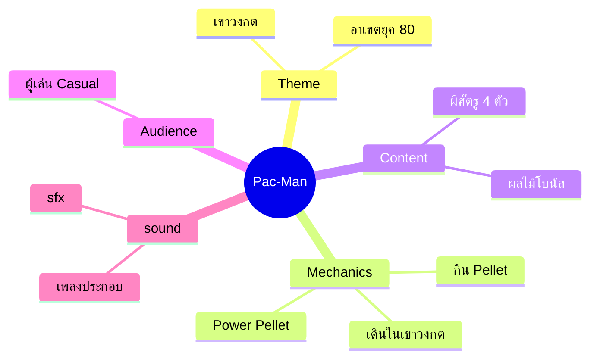
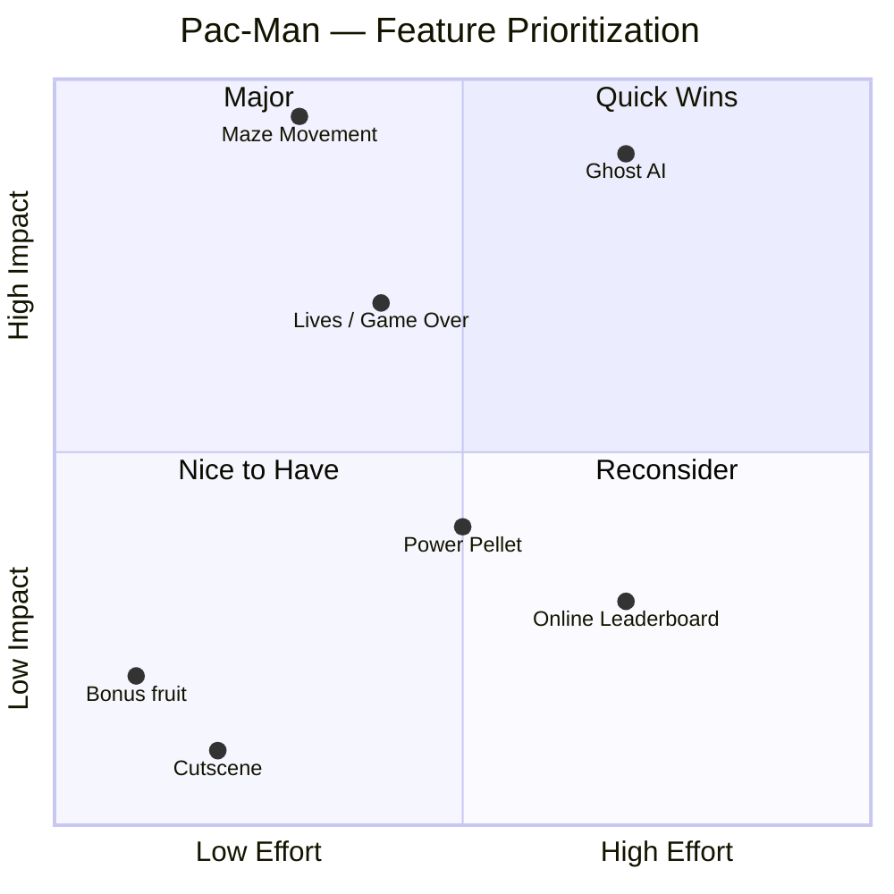
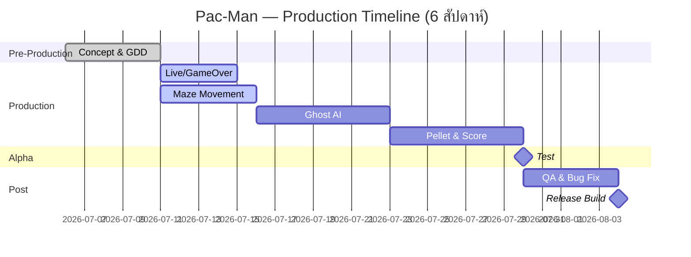

```mermaid
	mindmap
   root((Pac-Man))
         Theme
          เขาวงกต
          อาเขตยุค 80
         Mechanics
          เดินในเขาวงกต
          กิน Pellet
          Power Pellet
         Content
          ผีศัตรู 4 ตัว
          ผลไม้โบนัส
         Audience
          ผู้เล่น Casual
         sound
          sfx
          เพลงประกอบ
```

```mermaid
quadrantChart
  title Pac-Man — Feature Prioritization
   x-axis Low Effort --> High Effort
   y-axis Low Impact --> High Impact
  quadrant-1 Quick Wins
  quadrant-2 Major
  quadrant-3 Nice to Have
  quadrant-4 Reconsider
  Maze Movement: [0.3, 0.95]
  Ghost AI: [0.7, 0.9]
  Online Leaderboard: [0.7, 0.3]
  Bonus fruit: [0.1, 0.2]
  Cutscene: [0.2, 0.1]
  Lives /  Game Over: [0.4, 0.7]
  Power Pellet: [0.5, 0.4]
```

1.MVP-Maze movement,Live/GameOver,Ghost AI ทำให้เกมเป็นเกม

2.Cut-Bonus Fruit,Power Pellet,Cut scene,Online Leaderboard อาจจะไม่จำเป็นเปลืองเวลา

```mermaid
gantt
title Pac-Man — Production Timeline (6 สัปดาห์)
dateFormat YYYY-MM-DD
section Pre-Production
Concept & GDD :done, c1, 2026-07-06, 5d
section Production
Live/GameOver :active, p1, after c1, 4d
Maze Movement :active, p1, after c1, 5d
Ghost AI : p2, after p1, 7d
Pellet & Score : p3, after p2, 7d
section Alpha
Test :milestone, p4,	 after p3, 0d
section Post
QA & Bug Fix : q1, after p3, 5d
Release Build :milestone, m1,	 after q1, 0d
```
